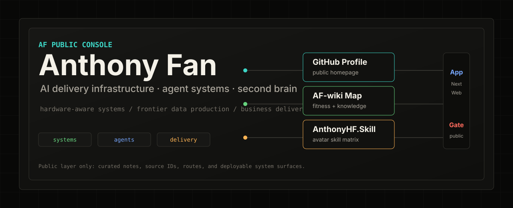

<div align="center">
  

  <p>
    <a href="https://haodifan.github.io/AF-wiki/"></a>
    <a href="https://haodifan.github.io/AnthonyHF.Skill/"></a>
    <a href="https://chat-gpt-next-web-haodifan.vercel.app"></a>
  </p>
</div>

## Public System

| Surface | Role | Route |
|:--|:--|:--|
| GitHub Profile | Public homepage and project facade | [github.com/HaodiFan](https://github.com/HaodiFan) |
| AF-wiki Map | Fitness memory, knowledge graph, source boundary, and area navigation | [haodifan.github.io/AF-wiki](https://haodifan.github.io/AF-wiki/) |
| AnthonyHF.Skill | Personal avatar skill matrix and Anthony-specific context router | [haodifan.github.io/AnthonyHF.Skill](https://haodifan.github.io/AnthonyHF.Skill/) |
| ChatGPT Next Web | App-layer AI chat deployment | [chat-gpt-next-web-haodifan.vercel.app](https://chat-gpt-next-web-haodifan.vercel.app) |

## Operating Thesis

Most AI work fails somewhere between model capability and real-world use. My work is about closing that gap: understanding the ceiling, shaping the data frontier, and shipping systems that survive production.

| Layer | Focus | What I bring |
|:--|:--|:--|
| Ceiling | NVIDIA Tegra SoCs, Xavier / Orin | Hardware-aware system thinking, profiling, and architecture tradeoffs |
| Frontier | Frontier-model data production | GUI Agent trajectories, QC workflow, and high-throughput data operations |
| Ground | Business delivery | 30+ AI solutions across 4 industries, from RPA to LLM and GUI agents |

## Current Focus

**MetaInFlow**: AI delivery infrastructure for downstream markets.

The bottleneck is not only algorithms. It is delivery: turning frontier AI into maintainable, ROI-positive business systems.

## Timeline

```text
2007      First line of code
2016      UIUC — Electrical & Computer Engineering
2018      NVIDIA Shanghai — Tegra SoC team
2021-2025 Shanghai Zhijue Information Technology Co., Ltd. — AI Tech Lead
2022-2025 MetaUniTech — personal brand and Explore AGI work
2025-2026 GrainedAI — Co-founder & CTO
2026 ->   MetaInFlow — Co-founder & CTO
```

## Recent Updates

<!-- WIKI-FEED:START -->
| Date | Area | Update |
|:-----|:-----|:-----|
| 04-20 | 🔧 System | area 层收敛为动态模块：knowledge 提升为 area，并补 work area 骨架 — [→](https://github.com/HaodiFan/AF-wiki/blob/main/log.md) |
| 04-19 | 🔧 System | LeadFlow 架构正式命名，并统一仓库与主页文案 — [→](https://github.com/HaodiFan/AF-wiki/blob/main/log.md) |
| 04-18 | 📋 Planning | W17 训练计划改为下肢、游泳、推拉混合，并匹配营养节奏 — [→](https://github.com/HaodiFan/AF-wiki/blob/main/areas/fitness/20-weeks/2026-W17-plan.md) |
| 04-18 | 🏊 Fitness | 游泳 500m，配速 4'37/100m，平均心率 150 bpm — [→](https://github.com/HaodiFan/AF-wiki/blob/main/areas/fitness/10-checkins/2026-04.md) |
| 04-18 | 🥩 Nutrition | 晚餐牛腱子加牛肉约 750g，当日蛋白基本已覆盖 — [→](https://github.com/HaodiFan/AF-wiki/blob/main/areas/fitness/10-checkins/2026-04.md) |
| 04-18 | 📋 Planning | 当前减脂主计划固定为 3 次游泳加 3 次力量代谢训练 — [→](https://github.com/HaodiFan/AF-wiki/blob/main/areas/fitness/02-current-plan.md) |

<!-- WIKI-FEED:END -->

## Featured Repos

| Repo | Why it matters |
|:--|:--|
| [AF-wiki](https://github.com/HaodiFan/AF-wiki) | Public second-brain source for areas, fitness memory, knowledge curation, source manifests, and the Pages map. |
| [AnthonyHF.Skill](https://github.com/HaodiFan/AnthonyHF.Skill) | Personal avatar skill matrix and Anthony-specific working context. |
| [snapAF-skills](https://github.com/HaodiFan/snapAF-skills) | Local skill collection for media, productivity, domain, and devops workflows. |

<details>
<summary><strong>中文版本</strong></summary>

## 核心主张

我关注的不是“AI 看起来很强”，而是它能不能在真实业务里稳定落地。我的工作长期围绕三层展开：硬件和系统边界、前沿数据生产、业务交付闭环。

| 层级 | 关注点 | 我的能力 |
|:--|:--|:--|
| 天花板层 | NVIDIA Tegra SoC，Xavier / Orin | 了解硬件边界、性能约束和系统架构取舍 |
| 前沿层 | 前沿模型数据生产 | GUI Agent 轨迹、QC 流程、高吞吐数据生产 |
| 地面层 | 业务交付 | 4 个行业 30+ AI 方案，从 RPA 到 LLM / GUI Agent |

## 当前主线

**MetaInFlow**：面向下游市场的 AI 交付基础设施。

真正的瓶颈不只是算法，而是交付：把前沿 AI 变成可运行、可维护、能产生 ROI 的业务系统。

## 最近动态

<!-- WIKI-FEED-ZH:START -->
| 日期 | 领域 | 动态 |
|:-----|:-----|:-----|
| 04-20 | 🔧 系统 | area 层收敛为动态模块：knowledge 提升为 area，并补 work area 骨架 — [→](https://github.com/HaodiFan/AF-wiki/blob/main/log.md) |
| 04-19 | 🔧 系统 | LeadFlow 架构正式命名，并统一仓库与主页文案 — [→](https://github.com/HaodiFan/AF-wiki/blob/main/log.md) |
| 04-18 | 📋 规划 | W17 训练计划改为下肢、游泳、推拉混合，并匹配营养节奏 — [→](https://github.com/HaodiFan/AF-wiki/blob/main/areas/fitness/20-weeks/2026-W17-plan.md) |
| 04-18 | 🏊 健身 | 游泳 500m，配速 4'37/100m，平均心率 150 bpm — [→](https://github.com/HaodiFan/AF-wiki/blob/main/areas/fitness/10-checkins/2026-04.md) |
| 04-18 | 🥩 营养 | 晚餐牛腱子加牛肉约 750g，当日蛋白基本已覆盖 — [→](https://github.com/HaodiFan/AF-wiki/blob/main/areas/fitness/10-checkins/2026-04.md) |
| 04-18 | 📋 规划 | 当前减脂主计划固定为 3 次游泳加 3 次力量代谢训练 — [→](https://github.com/HaodiFan/AF-wiki/blob/main/areas/fitness/02-current-plan.md) |

<!-- WIKI-FEED-ZH:END -->

</details>
